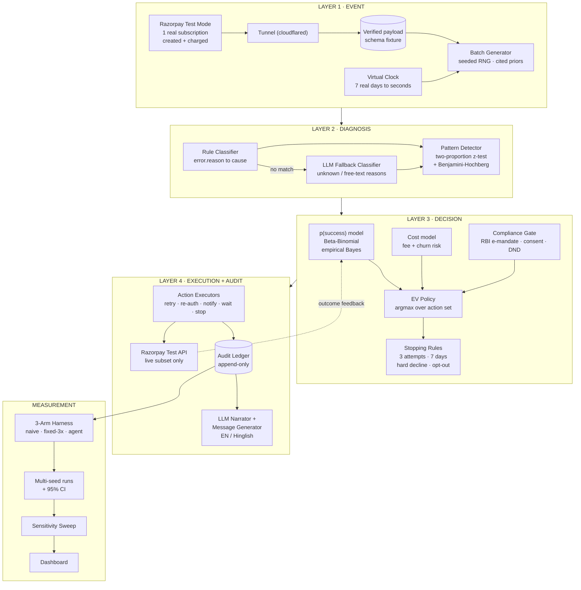
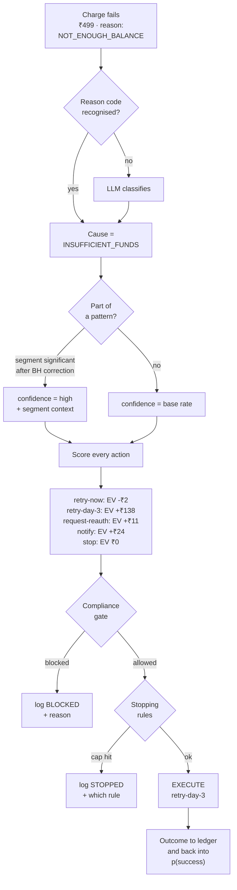

# AI Revenue Recovery — Work Plan

**Track:** AI Revenue Recovery — *"Find revenue that's slipping away and win it back"*
**Lane chosen:** Failed-subscription recovery + mandate retry sequencing
**Deadline:** 5 Sep 2026 · **Revised:** 27 Aug 2026 · **Working days remaining: 10**

---

## 1. What is the problem? (plain language)

A merchant sells something on a subscription — a ₹499/month app, a gym plan, a SaaS seat. Every month, Razorpay automatically tries to pull that money from the customer's bank account or card. This is called a **recurring charge**, and it runs on a **mandate** (the customer's standing permission to be charged).

Sometimes that automatic charge **fails**. Not because the customer wants to quit — they still want the product — but because of a boring mechanical reason:

| What went wrong | Plain meaning |
|---|---|
| Insufficient funds | The account was empty *that particular day* |
| Card expired | The saved card ran out of validity |
| Mandate expired / revoked | The standing permission lapsed |
| Bank server down | The bank's system was having a bad hour |
| Network timeout | The request never got a clean answer |
| Hard decline | The bank said a firm, permanent "no" |

Here's the money problem. Most merchants handle **all** of these the same way: *"retry after 24 hours, once."* That single dumb rule is wrong in both directions:

- It **wastes attempts** — retrying a charge whose mandate is dead can never succeed, no matter how many times you try. Every wasted attempt costs a small fee and annoys the customer.
- It **gives up too early** — a bank that was down for an hour would probably have worked 3 hours later. An empty account on the 28th is often a full account on the 2nd, right after salary lands. The naive rule abandons money that was genuinely recoverable.

So real revenue quietly leaks away, and nobody notices, because each individual failure is small.

### What we are building

An agent that, for a **batch** of failed recurring charges:

1. **Detects** which charges failed and how much money is at stake
2. **Diagnoses** *why* each one failed — and whether it's a one-off accident or part of a pattern (e.g. one bank failing far more than the others)
3. **Decides** the single best next action for *that specific case*, weighing the chance it works against what the attempt costs
4. **Executes** that action against Razorpay's test APIs, inside hard safety limits
5. **Proves** with honest numbers how much money came back — compared against what a dumb baseline would have recovered on the exact same batch

### What "good" looks like for this track

The brief's bar is explicit: *don't just identify the problem — show **measured money recovered across a batch**, with compliant escalation, stopping rules, and an audit trail.* So the deliverable is not a demo of one lucky save. It is a **measured comparison**, with confidence intervals, plus a log that shows every action taken *and every action deliberately not taken*.

### The honesty problem we must solve (read this twice)

We cannot fail 10,000 real subscriptions in ten days, so most of our event batch is **simulated**. That creates a trap: if we invent the numbers that decide whether a retry succeeds, and then our agent "discovers" those same numbers and beats the baseline — **we've proved nothing.** The result was baked in from the start, and a sharp judge will spot it in thirty seconds.

Three defences, built into the plan and non-negotiable:

- **Sourced, not invented.** Recovery-rate assumptions come from cited published dunning/recovery benchmarks, recorded in `sources.md` with a link next to each number.
- **Held out.** The parameters that generate simulated outcomes are never visible to the agent. It must learn timing and success rates from *observed* outcomes only, exactly as it would in production.
- **Sensitivity-tested.** We don't report one number. We sweep the key assumptions and report the range over which our agent wins — **and where it stops winning.** *"Cause-aware beats the fixed-retry baseline for any day-3 insufficient-funds recovery rate above ~12%"* is a far stronger, more credible claim than a single precise-looking figure from a simulator we built ourselves.

We say plainly in the write-up that the batch is simulated. Owning that is more persuasive than hiding it.

---

## 2. Architecture

### 2.1 System view



### 2.2 Life of one failed charge



### 2.3 Design decisions worth defending

**The LLM never decides where money goes.** Diagnosis-fallback, narration and message-writing are LLM jobs. The retry/stop decision is a deterministic, inspectable EV calculation. This is a *feature*, not a limitation — every rupee-affecting decision can be replayed and explained from the ledger. Say this out loud in the demo; it pre-empts the obvious "is this just an LLM guessing?" challenge.

**Why an EV policy and not a lookup table.** A four-row cause→action table is table stakes — Razorpay already ships Smart Retries. Our policy scores every available action:

```
EV(action) = p(success | cause, attempt#, timing, history) × amount
             − attempt_cost − P(churn | attempts) × LTV
```

The intuitive answers fall out as special cases: a dead mandate has p≈0, so retry loses to re-auth automatically; a hard decline drives EV negative, so the agent stops on its own. But unlike a table, it also gives a principled answer on the *ambiguous* cases, and it makes "fewer wasted attempts" a designed outcome rather than a happy accident.

**Why Beta-Binomial empirical Bayes for p(success).** Priors come from cited benchmarks; posteriors update from observed outcomes. It handles sparse cells gracefully (a segment with 3 observations doesn't produce a wild estimate), it's explainable in one sentence to a judge, and the uncertainty interval falls straight out — which we need for the confidence field in the audit log. Logistic regression would need more data and explain worse.

**Why a virtual clock.** Recovery windows are 7 days; the demo is 5 minutes. The simulator advances a virtual clock so a full 7-day window replays in seconds, while real API calls on the live subset happen immediately and carry both real and virtual timestamps.

**Two baselines, not one.** Beating *"retry everyone once"* is beating a strawman. We also implement *"retry 3× on a fixed schedule"*, which is closer to what merchants actually do. Beating that is the claim that means something.

---

## 3. Tech stack

| Layer | Choice | Why this one |
|---|---|---|
| **Core language** | Python 3.11+ | The stats layer (scipy) and the simulation/data layer (pandas, numpy) are the hard parts. Python is the only sane choice for those. |
| **API / service** | FastAPI + Uvicorn | Async, typed, auto-generated OpenAPI docs — useful as a judging artefact. Serves the dashboard's data. |
| **Data validation** | Pydantic v2 | Every event, decision and ledger row is a typed model. Stops schema drift between the six modules. |
| **Storage** | SQLite + SQLAlchemy | Zero setup, zero network dependency, **cannot fail during a live demo**. SQLAlchemy keeps the Postgres/Supabase swap one connection-string away if a hosted URL is ever needed. |
| **Stats** | scipy.stats, statsmodels | Two-proportion z-test / chi-square for segment significance; Benjamini-Hochberg for multiple comparisons (we test many segments — uncorrected p-values would manufacture fake patterns). |
| **Payments** | `razorpay` Python SDK, **test mode only** | Real Subscriptions/Payments API surface for the live execution subset. |
| **Webhook capture** | `cloudflared` tunnel | Day-1 only: needs a public URL to receive one real webhook and lock the true payload schema. No account needed, unlike ngrok's current limits. |
| **LLM** | **Open-source weights, self-hosted** — Qwen2.5-7B-Instruct via **Ollama** | Fallback reason classifier (via Ollama's **JSON-schema structured output**, so results are parseable enums and never free text), audit narration, and customer message generation in English + Hinglish. See §3.1 for why open source, and what it costs us. |
| **Frontend** | React + Vite + TypeScript | Fast build, and the stack you already have muscle memory in from the POS project. |
| **UI kit** | Tailwind CSS + shadcn/ui | Same reason — reuse, don't relearn. Judge-facing polish for near-zero time cost. |
| **Charts** | Recharts | Three-arm comparison bars, recovery-over-time lines, sensitivity band plots. |
| **Config** | `pydantic-settings` + `.env` | Razorpay keys never touch git. The local model needs no key at all. `.env.example` committed, `.env` git-ignored. |
| **Reproducibility** | seeded `numpy.random.Generator` + run manifest | Every run writes its seed, config hash and git SHA. A judge can reproduce any number we report. |
| **Testing** | pytest | Focused: compliance gate, stopping rules, EV maths. These are the three things that must not be wrong. |

**Deliberately not used:** Celery/Redis (the virtual clock replaces real scheduling), Docker (adds setup risk for no demo benefit at this scale), a vector DB (nothing here is a retrieval problem), any real customer PII (all simulated identities), and any hosted LLM API (see below).

### 3.1 Why an open-source, locally-served model

**What we gain.**

- **The demo cannot fail on network.** Everything — SQLite, Ollama, FastAPI — runs on the laptop. No API key to expire, no rate limit mid-pitch, no venue wifi.
- **No per-run cost.** The experiment harness replays 10k events × 3 arms × 3 cycles × 30 seeds. Even with classification cached outside the loop, a hosted API makes iteration something you ration. Local inference makes it free, so we re-run freely.
- **Data never leaves the machine.** Payment failure records — even simulated ones — never transit a third party. For a payments audience this is a real answer to a real question, not a talking point.
- **Reproducibility.** A pinned open-weights model + fixed seed + `temperature=0` is closer to genuinely reproducible than a hosted endpoint that can be updated underneath us.

**What it costs us, stated honestly.**

- **Hinglish quality is the risk.** Code-mixed Hindi-English generation was the single strongest justification for having an LLM at all, and it is exactly the task a 7B open model is weakest at. **Validate this on Day 7 before relying on it.** If output quality is poor: try a larger model if VRAM allows, or an India-tuned open model, and if neither works, fall back to English-only (§5 rank 7) rather than shipping bad Hinglish to a room full of Hindi speakers.
- **Weaker instruction-following** on the narration task. Mitigated by keeping prompts narrow and single-purpose rather than asking for long reasoning.
- **Local hardware becomes a dependency.** A 7B model at Q4 needs roughly 5–6 GB; it runs on CPU if there's no GPU, just slowly. Since no LLM call sits inside the experiment loop, slow is survivable — but pull the model on Day 1, not Day 7.

**Portability.** We call Ollama through its client library, but every call is a single-purpose function in one module. Ollama, vLLM, llama.cpp, or a hosted endpoint are a one-file swap. Nothing else in the codebase knows which model is behind it.

**Unchanged by this swap:** the LLM still never touches the money decision. Retry-or-stop stays a deterministic EV calculation. If anything this matters *more* now — a smaller model is a weaker reasoner, which is a good reason to keep it off the money path and an easy point to make on stage.

---

## 4. Day-by-day plan (27 Aug → 5 Sep, 10 days)

> **Schedule note (27 Aug):** the original draft assumed a start on 26 Aug. That day has passed with the repo still empty, so this is now a **10-day** plan. The lost day was absorbed by merging diagnosis and pattern detection into a single day (Day 3) rather than by eating the final buffer — buffer is what saves hackathons, and pattern detection is already ranked cuttable (§5). **If another day slips, cut from §5; do not spend the buffer.**

> **Rule for the whole plan:** every day ends with something committed and runnable. No day ends with "nearly working."

### Day 1 — Thu 27 Aug · Razorpay reality check + scaffold
**Hard timebox: stop at end of day regardless of outcome.**
- `git init` a **real repo inside `GIT/RazorPay/`** — the home directory is currently the git root, which is not a workable project repo
- Repo scaffold, `.env.example`, `.gitignore`, package layout, pytest wired
- ~~Razorpay test-mode: create plan → subscription → authorise → "Charge this now"~~ **BLOCKED — Subscriptions not enabled on this account** (`/v1/plans` and `/v1/subscriptions` return 401 while Payments/Orders/Payment Links return 200; enabling needs full KYC, 3–4 working days). Substituted with **Payment Links**: `scripts/create_payment_link.py` → open `short_url` → pay with a failing test card. Same `error.*` schema. Recorded in `sources.md` §6
- Minimal FastAPI app with a `/webhook` route + `cloudflared` tunnel; capture one real `payment.failed` and one `subscription.charged` payload
- Commit raw payloads to `fixtures/` as the schema ground truth
- **Install Ollama and `ollama pull qwen2.5:7b-instruct` in the background while doing the Razorpay work** — it's a multi-GB download and you do not want to discover it on Day 3

**Done when:** a real Razorpay webhook payload is saved in the repo.
**⚠ Risk:** test mode will *not* reliably produce every failure reason we need. Do not spend days chasing that. We need the **schema**, not the variety — the variety comes from the generator. If webhooks fight back by mid-afternoon, fall back to the documented payload shape from Razorpay's docs, note the substitution in `sources.md`, and move on.

### Day 2 — Fri 28 Aug · Data layer + generator + virtual clock
- Pydantic models: `ChargeAttempt`, `FailureEvent`, `Decision`, `LedgerEntry`
- SQLite schema + SQLAlchemy models; **append-only** ledger (no UPDATE, no DELETE)
- Seeded batch generator producing payloads matching Day-1 fixtures
- `sources.md` started: every distribution parameter gets a citation *as it is written*, not retro-fitted
- Virtual clock; generator emits the 10k volume batch + the ~100-event live subset
- **Write `definitions.md` today, before any metric exists** (see §4.1) — what counts as "recovered" must be pinned before anything measures it

**Done when:** `python -m recovery.generate --seed 42` produces a reproducible batch, the ledger accepts writes, and `definitions.md` is committed.

### Day 3 — Sat 29 Aug · Diagnosis + pattern detection *(long day — weekend)*
**Part A — classification (must finish):**
- Cause taxonomy (7–9 categories) mapped from `error.reason` / `error.code`
- Deterministic rule classifier with an explicit unmapped → `UNKNOWN` path
- LLM fallback classifier using Ollama **JSON-schema structured output** with a fixed enum, `temperature=0`; caching so a repeated reason string costs one call, and a hard timeout falling back to `UNKNOWN` rather than blocking the batch
- Classifier accuracy measured against generator labels **as an evaluation only** — labels stay out of the runtime path

**Part B — pattern detection (timeboxed; this is the merged-in work):**
- Segment builder: bank × amount-band × time-of-day × card-network × attempt-number
- Two-proportion z-test of each segment's failure rate vs. baseline, with a minimum-support threshold
- **Benjamini-Hochberg correction** — we test dozens of segments; without correction we will "find" patterns that aren't there, and that is exactly the kind of thing that gets challenged
- Confidence score attached to each diagnosis
- **Run the null test:** the detector must find planted effects in the 10k batch and report ~nothing on a null batch. This is the credibility test — if there is time for only one thing in Part B, it is this

**Done when:** every event carries a cause + classification source (`rule` | `llm`). **If Part B is not done by end of day, stop and fall back to per-cause base rates** (§5 rank 8). Do not let it eat Day 4.

### Day 4 — Sun 30 Aug · Decision layer (the differentiator)
- Beta-Binomial p(success) model, priors from `sources.md`, posterior updates from observed outcomes only
- **Cold-start handling (see §4.2)** — decide and document what the agent does on cycle 1, when it has no observed outcomes at all
- Cost model: attempt fee, notification cost, P(churn | attempts) × LTV
- Action set: `retry-now`, `retry-delayed(window)`, `request-reauth`, `notify`, `wait`, `stop`
- **Compliance gate as a hard pre-filter:** RBI e-mandate 24h pre-debit notification, additional-factor authentication above ₹15,000, per-mandate caps, consent/DND for messaging. Blocked actions are *logged as blocked*, never silently dropped
- **Stopping rules:** max 3 attempts, 7-day window, halt on hard decline, halt on opt-out, halt on negative EV
- pytest coverage on the gate, the stopping rules and the EV maths

**Done when:** given any event, the policy returns a ranked action list with EV shown per action, and tests prove the caps cannot be exceeded.

### Day 5 — Mon 31 Aug · Execution + audit
- Executors for each action; real Razorpay test-API calls on the live subset, simulated resolution elsewhere
- **Idempotency keys** — a crash mid-run must not double-charge anyone
- Ledger writes: original reason, diagnosed cause, confidence, EV table, action, outcome, ₹ recovered, and **stop reason when stopped**
- Full end-to-end run over the live subset

**Done when:** a real retry executes against Razorpay test mode and lands in the ledger with a complete decision trail.

### Day 6 — Tue 1 Sep · Multi-arm experiment harness
- Arm A naive (retry once, fixed delay) · Arm B fixed-3× schedule · Arm C EV agent
- **Paired counterfactual replay with common random numbers:** every arm sees the *identical* event set, and the RNG stream that resolves outcomes is seeded identically across arms. Production A/B would randomly assign events to arms; in a simulator, paired replay is strictly better — it removes between-batch variance and gives us three times the effective sample size for the same compute. Report **paired differences** (agent minus baseline, per event), not just two independent means
- **Multi-cycle run** — at least 3 consecutive billing cycles, so the learning claim in §4.2 is actually exercised rather than asserted
- Multi-seed runner (≥30 seeds) with 95% confidence intervals on the paired difference
- **Performance guard:** no LLM calls inside the experiment loop. Classification runs once per batch and is cached; 30 seeds × 10k events × 3 arms × 3 cycles is ~2.7M resolutions and must be numpy-vectorised, not a per-event Python loop with network I/O
- Metrics per `definitions.md`: recovery rate, gross ₹, **net ₹ after costs**, wasted attempts, attempts-per-recovery, time-to-recovery, compliance violations (target: 0)

**Done when:** `python -m recovery.experiment --seeds 30 --cycles 3` prints an arm-by-arm table with paired-difference CIs, in under two minutes.

### Day 7 — Wed 2 Sep · Sensitivity + LLM surfaces
- Sweep the parameters the result is most sensitive to; produce the **crossover statement** ("we win above X%, we lose below it")
- **The churn-penalty parameter gets its own sweep and its own slide** (see §4.3) — it is the softest number in the EV formula and the one most likely to be challenged
- LLM audit narration: ledger → readable "why we did this / why we stopped"
- Customer message generation per channel and language, including **Hinglish** — **quality-check the local model's Hinglish first** (§3.1); if it's poor, switch models or drop to English-only rather than shipping it
- Freeze the headline numbers into `results.json`

**Done when:** the sensitivity band is plotted, the churn-penalty sweep is separate and legible, and the crossover point is a sentence we can say on stage.

### Day 8 — Thu 3 Sep · Dashboard
- Batch view → drill into any single charge → full audit trail with EV table and stop reason
- Arm comparison with error bars; sensitivity band; wasted-attempt delta
- Compliance panel: what was blocked and why (this is the panel that proves "bounded")

**Done when:** the whole story is clickable end-to-end with no terminal required.

### Day 9 — Fri 4 Sep · Harden + write-up + submission artefacts
- README: problem, architecture, how to reproduce, **explicit statement that the batch is simulated and why the result still holds**
- `sources.md` and `definitions.md` finalised
- **Submission artefacts** — pitch deck and/or demo video per the actual submission requirements (confirm what those are *before* today; a demo video alone is easily a half-day)
- Demo script, timed to fit; rehearse twice
- Kill every crash path: empty batch, API timeout, missing key, LLM unavailable → all must degrade gracefully, not throw

**Done when:** a cold `git clone` + `.env` + one command reproduces the headline numbers, and every required submission artefact exists.

### Day 10 — Sat 5 Sep · Buffer + submit
Buffer only. **Do not start new features today.** If Days 1–9 held, use it for demo polish and rest.

---

### 4.1 Pin down "recovered" before anything measures it

The headline number is meaningless until this is written down. Decide and commit on Day 2:

- Does a charge that succeeds on day 5 after two retries count as recovered? (Proposed: **yes**, within the 7-day window.)
- Does a re-auth the customer completes on day 9 count? (Proposed: **no** for the headline metric — report it separately as *assisted recovery* so we neither lose the credit nor inflate the main number.)
- Is recovery counted **gross** or **net of attempt costs**? (Proposed: report both, lead with **net** — it's the honest one and it's the one that rewards not wasting retries.)
- Does a customer who pays through a different channel after a notification count? (Proposed: yes, but tagged by attribution route.)

None of these are hard calls. All of them are fatal to argue about on Day 6 with a half-built harness.

### 4.2 The cold-start hole

The p(success) model learns from observed outcomes. On the **first** billing cycle it has none — it runs purely on priors, which means on a single-batch demo the agent is, functionally, the lookup table it claims not to be. A judge can find this in one question.

The fix is to make the evaluation multi-cycle: run 3+ consecutive cycles and show the posterior tightening and the policy *changing its mind* — e.g. the retry window for insufficient-funds shifting as evidence accumulates. Then "it learns" is a demonstrated behaviour with a chart, not a claim. This is why Day 6 runs cycles, not just seeds.

If cycles have to be cut for time, the honest framing changes to: *"the priors are cited, the policy is cause-and-cost-aware, and the learning loop is implemented and exercised over N cycles"* — say what was actually tested, not what the architecture is capable of.

### 4.3 The softest number in the model

`P(churn | attempts) × LTV` is doing heavy lifting: it is the term that makes the agent stop early and produces the "fewer wasted attempts" result. It is also the least sourceable number in the whole design. Treat it accordingly — give it its own sensitivity sweep, show the result at churn-penalty = 0 (i.e. the agent's advantage with the softest assumption switched off entirely), and if the advantage survives that, say so loudly. That single robustness check is worth more than three extra features.

## 5. Cut list — if we fall behind

**Cut from the bottom of this table upward.** Rank 1 is the last thing to go; rank 10 is the first. The top four map directly onto the track's stated bar (measured money, compliant escalation, stopping rules, audit trail) and are not negotiable at any point.

| Rank | Component | If we're behind |
|---|---|---|
| 1 | Cause diagnosis + EV decision + stopping rules | **Never cut** — this is the project |
| 2 | Measured multi-arm comparison with CIs | **Never cut** — this is the bar |
| 3 | Audit trail incl. blocked/stopped reasons | **Never cut** — this is "compliant, bounded" |
| 4 | Live Razorpay test-API execution on a subset | **Never cut** — proves it's real, not a toy |
| 5 | Sensitivity sweep | Degrade to 3 fixed scenarios — **never remove entirely**, it's our answer to "your numbers are circular" |
| 6 | Dashboard | Degrade to a static HTML report from `results.json` |
| 7 | Hinglish message generation | Cut to English-only (loses a visible, brief-named feature — cut reluctantly) |
| 8 | Pattern detection | Cut to per-cause base rates, no segments |
| 9 | LLM fallback classifier | Cut to rules + an `UNKNOWN` bucket |
| 10 | LLM audit narration | Cut to templated strings — reads almost as well for a fraction of the work |

> **Note on rank 8.** Pattern detection is the most intellectually interesting layer and the easiest to be proud of, which is exactly why it needs an explicit rank: it is *not* in the track's bar. It is now Day 3 Part B, behind a timebox. If it overruns, per-cause base rates keep the EV policy fully functional. Do not let it eat Day 4.

---

## 6. Known risks

| Risk | Impact | Mitigation |
|---|---|---|
| Test mode won't yield varied failure reasons | Diagnosis layer has thin real input | Day 1 is timeboxed to capture **schema** only; variety comes from the generator |
| **Subscriptions product not enabled (materialised 28 Aug)** | No live subscription charges | Capture via Payment Links instead — identical `error.*` fields; subscription semantics simulated. `mandate_*` causes have unverified payload shape; disclose in write-up |
| "Your numbers are circular" | Fatal to the whole claim | Cited priors, held-out parameters, sensitivity sweep, stated openly |
| Pattern detection on thin data | Fake findings, easy to attack | 10k volume batch + minimum support + BH correction + null-batch test |
| "This is just a lookup table" | Loses the differentiator | EV policy with explicit cost/churn terms; show the EV table per decision in the UI |
| "Razorpay already has Smart Retries" | Undercuts novelty | Position as cause-aware + cost-aware + compliance-bounded + auditable; measured against a fixed-3× baseline, not a strawman |
| 10 days, not 14 — a day already lost | Scope overrun | Cut list in §5, cut from the bottom; Day 10 stays buffer and is never spent on features |
| Cold start: no observed outcomes on cycle 1 | "It doesn't actually learn" | Multi-cycle evaluation (§4.2); show the policy changing its mind across cycles |
| Churn-penalty parameter is unsourceable | Softest link in the EV chain | Own sweep + a result at churn-penalty = 0 (§4.3) |
| "Recovered" left undefined until measurement | Metric becomes unarguable mush | `definitions.md` written Day 2, before any metric exists (§4.1) |
| Submission artefacts (deck / video) unscoped | Great build, missed submission | Confirm requirements now; Day 9 reserves time for them |
| Live demo depends on network | Catastrophic on stage | SQLite + Ollama both local; pre-recorded fallback of the live API call; dashboard reads from frozen `results.json` |
| Local 7B model produces poor Hinglish | Loses the strongest LLM justification | Validate Day 7, not demo day; larger or India-tuned model, else English-only (§5 rank 7) |
| Ollama model not downloaded until late | Day 7 blocked by a multi-GB pull | Pull on Day 1 alongside the Razorpay work |

---

## 7. The claim we are aiming to be able to make

> *"Across 30 seeded replays of a 10,000-event batch, the cause-aware agent recovered **₹X net** versus **₹Y** for a fixed-3× retry baseline on the identical events — a paired difference of **+₹D** (95% CI: …) — using **Z% fewer attempts**, with **zero** compliance-rule violations and a complete audit trail for every action taken and every action blocked. The batch is simulated on published recovery benchmarks; the advantage holds for any day-3 insufficient-funds recovery rate above ~N%."*

Every number in that sentence must be reproducible from the repo by a stranger.
